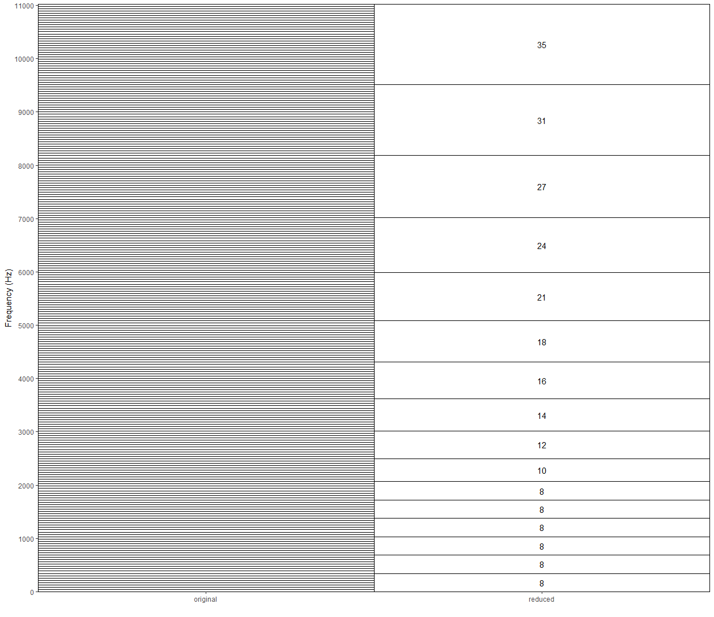
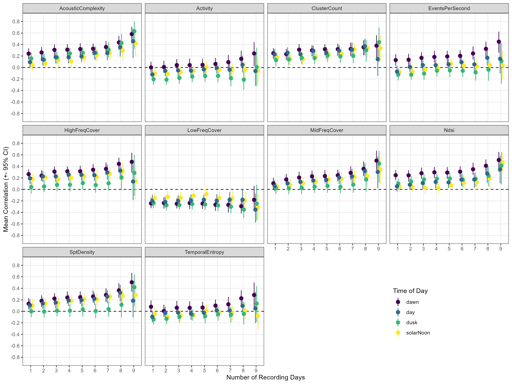
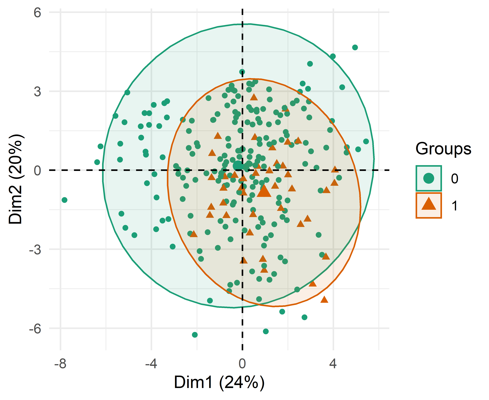

# noisyminer
Estimating Noisy miner presence and woodland bird diviersity using acoustic indices

***
## Acoustic & biodiversity data

### Acoustic data
Audio recordings were collected from 50 sites in 9 regions from November 2019 until February 2022.

A total of xxx minutes of audio were analysed.

### Biodiversity data 
Bird surveys were conducted on two seperate occassions during each sampling trip, and the following biodiversity metrics were calculated for the entire bird community and just Noisy miners.

Biodiversity metric | Definition
-------|---------------
**Total Bird Diversity** |
Detected20 | Number of species detected in 20 minute surveys
Detected40 | Number of species detected in 40 minute surveys
Mean20m | Number of individuals detected in 20 minute surveys
Mean40m | Number of individuals detected in 40 minute surveys
**Noisy Miner Diversity** | 
NMPresent | Whether Noisy miners were detected during either of the two replicate surveys
Threshold20m | Whether Noisy miners were present in numbers above a threshold (2.4 individuals)
Threshold40m | Whether Noisy miners were present in numbers above a threshold (7 individuals)
MeanMiner20m | The mean number of Noisy miners detected during 20 minute surveys
MeanMiner40m | The mean number of Noisy miners detected during 40 minute surveys

***
## Methods

### Generation of acoustic indices
Acoustic indices were generated for all recordings at a 1-minute temporal resolution using a combination of QUT's Analysis Programs (https://github.com/QutEcoacoustics/audio-analysis) and R (packages: `seewave` & `soundecology`). Recordings were processed on JCU's HPC by downloading files from UNE's Owncloud storage and ussing the following shell script:

* [batchJobScript_calculateIndices.sh](batchJobScript_calculateIndices.sh)

This shell script looped over all recordings contained in a [recording list](outputs/figures_2023/pca) scraped from UNE's Owncloud and generated Acoustic Indices using QUT's AP software and called the following R script to generate indices that were not available in AP.

* [GenerateIndices_HPC.R](scripts/GenerateIndices_HPC.R)

The following table outlines all the acoustic indices that were generated directly from the audio recordings:

Acoustic Index | Defition, packages, settings etc.
-------|---------------
**QUT Analysis Programs Indices**| 
Activity (ACT) | The fraction of values in the noise-reduced decibel envelope that exceed the threshold, θ = 3 dB.
EventsPerSecond (ENV) | A measure of the number of acoustic events per second, averaged over the same noise-reduced one-minute segment. An acoustic event is defined as starting when the decibel envelope crosses a threshold, θ, from below to above, where θ = 3 dB.
LowFreqCover (LFC) | The fraction of noise-reduced spectrogram cells that exceed 3 dB in the low-frequency band (1-1000 Hz).
MidFreqCover (MFC) | As for LFC but in the mid-frequency band (1000-8000 Hz).
HighFreqCover (HFC) | As for LFC but in the high-frequency band (8000–11025 Hz).
AcousticComplexity (ACI) | A measure of the relative change in acoustic intensity in each frequency bin.
TemporalEntropy (ENT) | Entropy of the energy (squared amplitude) values of the signal waveform.
ClusterCount (CLS) | The number of distinct spectral clusters in the mid-frequency band of a one-minute segment of recording.
Ndsi (NDSI) | NDSI aims at estimating the level of anthropogenic disturbance on the soundscape by computing the ratio of human-generated (anthropophony) to biological (biophony) acoustic components 
SptDensity (SPD) | A measure of the number of cells in the mid-frequency band of a one-minute spectrogram that are identified as being local maxima.
**R Indices**|
Acoustic Complexity Index (ACI) | Generated using the `soundecology` package. Settings: `min_freq = 0`, `max_freq = 11025`
Acoustic Diveristy Index (ADI) | Generated using the `soundecology` package. Settings: `max_freq = 10000`, `freq_step = 1000`
Acoustic Evenness Index (AEI) | Generated using the `soundecology` package. Settings: `max_freq = 10000`, `freq_step = 1000`
Normalised (NDSI) | Generated using the `soundecology` package. Default values used: `anthro_min = 1000`, `anthro_max = 2000`, `bio_min = 2000`, `bio_max = 11000`
Normalised (NDSI_bio) | Biophony component of NDSI (i.e., 2-11kHz)
Normalised (NDSI_anthro) | Anthropophony component of NDSI (i.e., 1-2kHz)
M | Median of the amplitude envelope `seewave`
H | Total entropy `seewave`
Ht | Temporal entropy `seewave`
Hf | Spectral entropy `seewave`
BI | Bioacoustic index `soundecology`

### Noisy miner specific indices
We calculated custom acoustic indices for specific frequency bands in an attempt to tailor them for predicting the presence and number of Noisy miners. These indices were derived by aggegrating (using mean) the 43.1Hz spectral indices for the appropriate frequency range.

We aggregated QUT's spectral indices (ACI, CVR, ENT, and PMN) at the following bands:
*1.5kHz - 4.0kHz
*2.0kHz - 3.0kHz
*4.0kHz - 7.0kHz
*5.0kHz - 6.0kHz

### Feature reduction
In addition to the spectral indices described above, we also derived a reduced set of spectral indices that may be useful for predicting either total bird biodiversity or Noisy miner presence. QUT's AP software outputs spectral indices at a 43.1Hz frequency resolution between 0 and 11025 Hz, resulting in a feature set of length 256 per spectral index. In order to reduce this large feature set to something more suitable for machine learning methods we aggregated spectral indices across the frequency range to reduce the length of each spectral index from 256 to 16. The image below illustrates the aggregation method used, based on the advice of Mike Towsey:

### Outlier removal
An initial inspection of acoustic index values identified some extreme values, particularly for ACI. We removed these extreme values as they are likely due to an extreme sound event that does not reflect a change in call diversity.
As we could check all the recordings individually for outlier events, we removed the bottom and top 0.5% of values for each acoustic index per site. Given our following aggregation of 1-minute acoustic index values into median values for different periods of the day, this removal represents only a tiny fraction of the overall data.

### Number of audio recording days used
To investigate the effect of recording duration on the relationship between acoustic indices and total bird biodiversity and Noisy miner presence and abundance, acoustic indices were aggregated using between 1 and 9 days of audio recordings collected around the time of each survey period.

Days were selected at random from the available audio within 2 days either side of the two replicate bird survey dates, and aggregated by calculating the median value for the time periods specified below.

*Note: Not all survey periods had a full 9 days of audio available within +- 2 days of the bird surveys, therefore sample size differs depending on the number of audio recording days considered.*

### Acoustic index aggregation
Acoustic indices were aggregated into median values for four different time periods:

* "dawn" - 2 hour period from 30 mins before sunrise until 1.5 hours after sunrise
* "solarNoon" - 2 hour period from 1 hour before solar noon until 1 hour after solar noon
* "dusk" - 2 hour period from 1.5 hours before sunset until 30 mins after sunset
* "day" - variable time period between sunrise and sunset

Sunrise and sunset times for all survey dates were extracted using the `suncalc` package (see [CalculateSunriseSunsetTimes.R](scripts/CalculateSunriseSunsetTimes.R))

Data were removed if less than 70% of audio was available for the respective time period.

### Plotting and analyses

All the following are done for both Replicate 1 only and Replicate 1&2 combined datasets.

#### Basic plots
[BasicPlots.R](scripts/BasicPlots.R) produces scatterplots for each acoustic index and each continuous biodiversity measure (Total20m, Total40m, Diversity20m, Diversity40m, TotalMiner20, TotalMiner40) and boxplots for each acoustic index and each binary biodiversity measure (Noisy miner presence-absence, Threshold20m, and Threshold40m).

For example (boxplots of Noisy miner presence for all acoustic indices calculated at dawn):

See [outputs/figures/basicplots](outputs/figures/basicplots) for all plots.

#### Correlation between biodiversity and individual indices
Bootstrap spearman correlations are calculated for all acoustic indices and bird biodiversity measures (all birds and miner measures) in the [BootstrapCorrelationPlots_Spearman.R](scripts/BootstrapCorrelationPlots_Spearman.R) script.

#### Multiple indices to predict Noisy miner presence (PCA - LDA)

PCA plots were produced for all Noisy miner presence variables (NMPresent, Threshold20m, Threshold40m) using all acoustic indices for the four time periods (dawn, solarNoon, dusk, day).

Linear discriminant analysis (LDA) was used to try to develop predictive models of Noisy miner presence using all principal components with eigenvalues greater than 1. 

***
## Results

### Total bird biodiversity

#### Correlation between biodiversity and individual indices

In general, acoustic indices had relatively low correlation scores (0-0.4) with bird biodiversity

*Figure X. Bootstrap spearman correlation estimates of individual acoustic indices and bird biodiversity (Species Diversity 20 minutes) across different numbers of audio recording days.*

Note: The above figure is for the indices generated using QUTs AP software. There are similar plots for indices created using R and for other biodiversity measures [here](outputs/figures_2023/bootstrapcorrelations)

### Noisy Miner presence/absence and abundance

#### Individual Acoustic Indices and Noisy miner presence

Using the spectral indices calculated at specific bands to detect Noisy miner presence, there seems to be some evidence that ACI and CVR (occasionally ENT and PMN too) are lower in the 4kHz-7kHz band when Noisy miners are present (during dawn and dusk). However, the effect sizes are small.

*Figure X. Raincloud plots of Spectral Indices for Noisy miner presence (1) and absence (0) at dusk using 5 days of audio.*

Using the summary indices, there appears to be some evidence that there are lower values of HFC and NDSI and higher values of LFC when Noisy miners are present. This was detected during both dawn and dusk periods (e.g. Figure 3). However, like above, effect sizes are small.

*Figure 3. Raincloud plots of Summary Indices for Noisy miner presence (1) and absence (0) at dawn using 5 days of audio.*

#### PCA plots of Noisy miner presence

There was poor separation between Noisy miner presence variables using combinations of acoustic indices in a PCA at any time period (Figure 4).

*Figure 4. PCA plots for Spectral Indices and the 'NMPresent' response (A:'dawn', B:'solarNoon', C:'dusk', D:'day'). Spectral indices used were ACI, CVR, ENT and PMN aggregated at four frequency bands (1.5kHz-4.0kHz, 2.0kHz - 3.0kHz, 4.0kHz - 7.0kHz, and 5.0kHz - 6.0kHz).*

Attempting to use unique time-of-day periods per acoustic index (selected based on their highest correlation with MeanMiner40m) produced similar results (Figure 5).

*Figure 5. PCA plot for Replicate 1 and 2 combined and the Threshold40m response using unique time periods per acoustic index*

See [outputs/figures_2023/pca](outputs/figures_2023/pca) for all PCA plots.

#### Performance of LDA models fit to Principal Components

### 