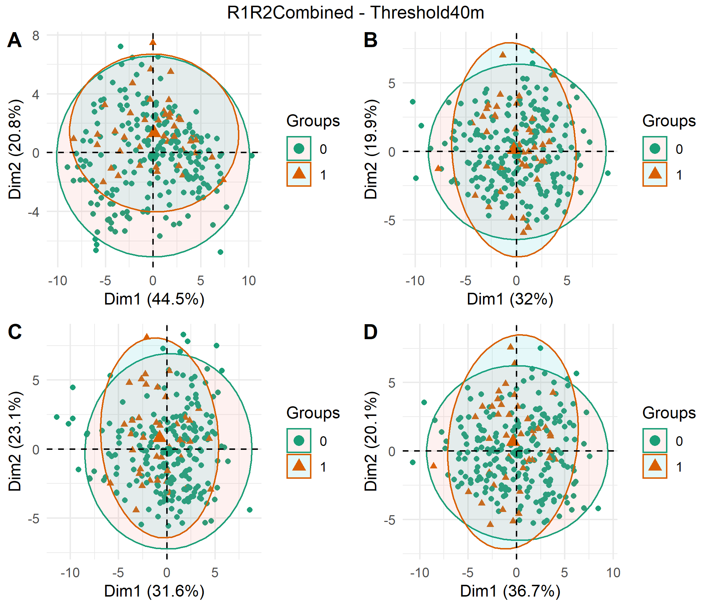

# noisyminer
Noisy miner and woodland bird diviersity using acoustic indices

***
## Scripts

1. Scripts for generating acoustic indices
  + [CalculateIndices_R.R](scripts/CalculateIndices_R.R)
  + [CalculateIndices_AP.R](scripts/CalculateIndices_AP.R)

***
## Methods

### Generation of acoustic indices
Acoustic indices were generated for all recordings at a 1-minute temporal resolution using a combination of R (packages: `seewave` & `soundecology`), and QUT's Analysis Programs (https://github.com/QutEcoacoustics/audio-analysis) using the following two scripts: 

* [CalculateIndices_R.R](scripts/CalculateIndices_R.R)
* [CalculateIndices_AP.R](scripts/CalculateIndices_AP.R)

The following acoustic indices have been generated:

Acoustic Index | Defition, packages, settings etc.
-------|---------------
**R Indices**|
Acoustic Complexity Index (ACI) | Generated using the `soundecology` package. Settings: `min_freq = 0`, `max_freq = 11025`
Acoustic Diveristy Index (ADI) | Generated using the `soundecology` package. Settings: `max_freq = 10000`, `freq_step = 1000`
Acoustic Evenness Index (AEI) | Generated using the `soundecology` package. Settings: `max_freq = 10000`, `freq_step = 1000`
Normalised (NDSI) | Generated using the `soundecology` package. Default values used: `anthro_min = 1000`, `anthro_max = 2000`, `bio_min = 2000`, `bio_max = 11000`
Normalised (NDSI_bio) | Biophony component of NDSI (i.e., 2-11kHz) *These values should probably be changed*
Normalised (NDSI_anthro) | Anthropophony component of NDSI (i.e., 1-2kHz) *These values should probably be changed*
M | Median of the amplitude envelope `seewave`
H | Total entropy `seewave`
Ht | Temporal entropy `seewave`
Hf | Spectral entropy `seewave`
BI | Bioacoustic index `soundecology`
**QUT Analysis Programs Indices**|
Activity (ACT) | The fraction of values in the noise-reduced decibel envelope that exceed the threshold, θ = 3 dB.
EventsPerSecond (ENV) | A measure of the number of acoustic events per second, averaged over the same noise-reduced one-minute segment. An acoustic event is defined as starting when the decibel envelope crosses a threshold, θ, from below to above, where θ = 3 dB.
SpectralCentroid (CENT) | 
LowFreqCover (LFC) | The fraction of noise-reduced spectrogram cells that exceed 3 dB in the low-frequency band (1-1000 Hz).
MidFreqCover (MFC) | As for LFC but in the mid-frequency band (1000-8000 Hz).
HighFreqCover (HFC) | As for LFC but in the high-frequency band (8000–11025 Hz).
AcousticComplexity (ACI) | 
TemporalEntropy (ENT) |
EntropyOfAverageSpectrum (EAS) |  
EntropyOfVarianceSpectrum (EVS) |
EntropyOfPeaksSpectrum (EPS) |
EntropyOfCoVSpectrum (ECS) |
ClusterCount (CLS) | The number of distinct spectral clusters in the mid-frequency band of a one-minute segment of recording.
ThreeGramCount (TGC) | COULD REMOVE?
Ndsi (NDSI) | 
SptDensity (SPD) | A measure of the number of cells in the mid-frequency band of a one-minute spectrogram that are identified as being local maxima.
CVR??? |

The following Noisy miner specific acoustic indices have been tried so far:

Acoustic Index | Def
-------|---------------
Bio_chur | Bioacoustic index calculated between 1166 and 3646 Hz. Based on the peak frequency (+-1 SD) of the 'chur' vocalisation in [Holt et al. 2017](https://www.tandfonline.com/doi/full/10.1080/01584197.2016.1252508)
CVR_ | Cover index between xxx Hz and xxx Hz - approximately same frequency as above
ENT_ | TemporalEntropy index between xxx Hz and xxx Hz -

### Acoustic index aggregation
Acoustic indices were aggregated into mean values for different time periods:

* "dawn" - 2 hour period from 30 mins before sunrise until 1.5 hours after sunrise
* "solarNoon" - 2 hour period from 1 hour before solar noon until 1 hour after solar noon
* "dusk" - 2 hour period from 1.5 hours before sunset until 30 mins after sunset
* "day" - variable time period between sunrise and sunset

Sunrise and sunset times for all survey dates were extracted using the `suncalc` package (see [CalculateSunriseSunsetTimes.R](scripts/CalculateSunriseSunsetTimes.R))

Data were removed if less than 70% of audio was available for that time period.

### Biodiversity data
The aggreated acoustic indices and biodiversity data for [Replicate 1](rawdata/FinalDataR1Only.csv) and [Replicate 2](rawdata/FinalMeanDataAllRepeats.csv) were joined using [CombineIndices&Biodiversity.R](scipts/CombineIndices&Biodiversity.R) for use in further analyses.

*Note: Noisy miner threshold columns appear to be incorrect in provided rawdata for Replicate 1, and are recalculated in the CombineIndices&Biodiversity.R script.*

### Plotting and analyses

All the following are done for both Replicate 1 only and Replicate 1&2 combined datasets.

#### Basic plots
[BasicPlots.R](scripts/BasicPlots.R) produces scatterplots for each acoustic index and each continuous biodiversity measure (Total20m, Total40m, Diversity20m, Diversity40m, TotalMiner20, TotalMiner40) and boxplots for each acoustic index and each binary biodiversity measure (Noisy miner presence-absence, Threshold20m, and Threshold40m).

For example (boxplots of Noisy miner presence for all acoustic indices calculated at dawn):
{width=50%}

See [outputs/figures/basicplots](outputs/figures/basicplots) for all plots.

#### Correlation between biodiversity and individual indices
Bootstrap spearman correlations are calculated for all acoustic indices and bird biodiversity measures (all birds and miner measures) in the [BootstrapCorrelationPlots_Spearman.R](scripts/BootstrapCorrelationPlots_Spearman.R) script.

#### Multiple indices to predict noisy miner presence

##### PCA

PCA plots were produced for all Noisy miner presence variables (R1Only - DetectedMiner20, DetectedMiner40, NMPresent, Threshold20m, Threshold40m) using all acoustic indices for the four time periods (dawn, solarNoon, dusk, day).

***
## Results

#### Correlation plots

Correlation of individual acoustic indices and bird biodiversity measures (Total 20 minutes, Total 40 minutes, Species Diversity 20 minutes, Species Diversity 40 minutes) for Replicate 1.

Correlation of individual acoustic indices and bird biodiversity measures (Total 20 minutes, Total 40 minutes, Species Diversity 20 minutes, Species Diversity 40 minutes) for Replicates 1 & 2 combined.

#### PCA plots of Noisy miner presence

See [outputs/figures/pca](outputs/figures/pca) for all plots.

Here is the plot for Replicate 1 and 2 combined and the Threshold40m response (A:'dawn', B:'solarNoon', C:'dusk', D:'day'):

Attempting to use unique time-of-day periods per acoustic index (selected based on their highest correlation with MeanMiner40m) produced similar results:

